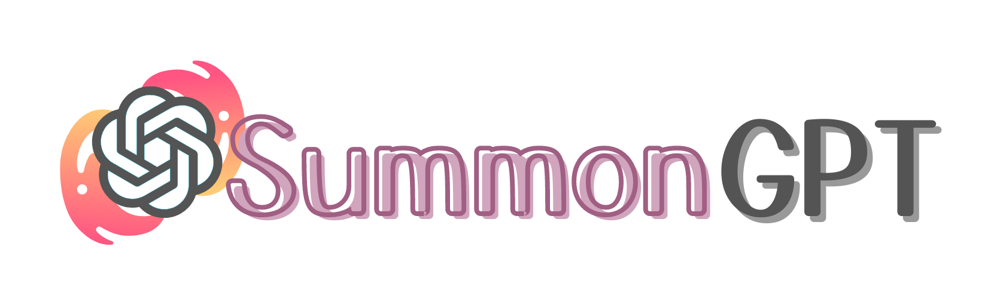
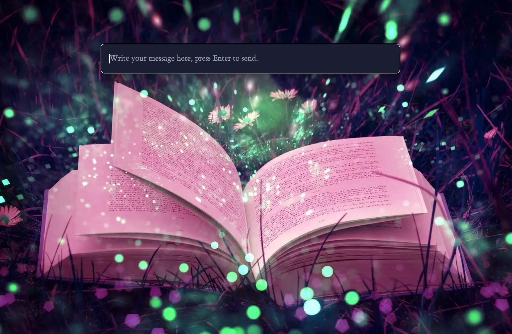
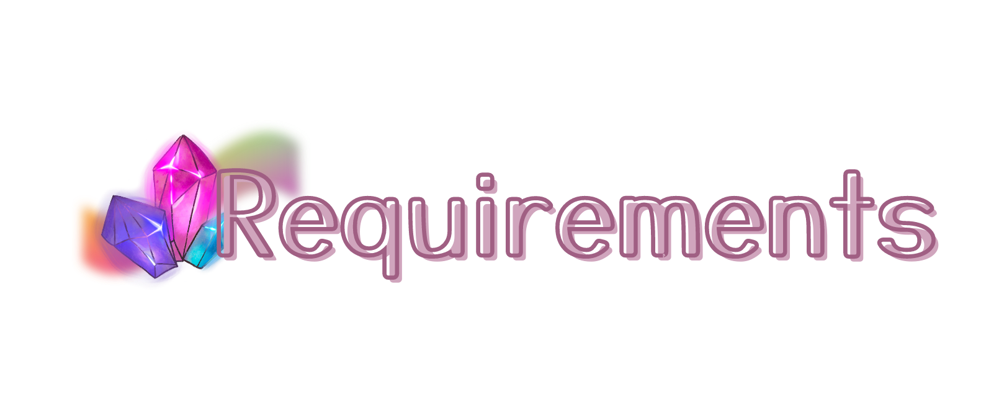
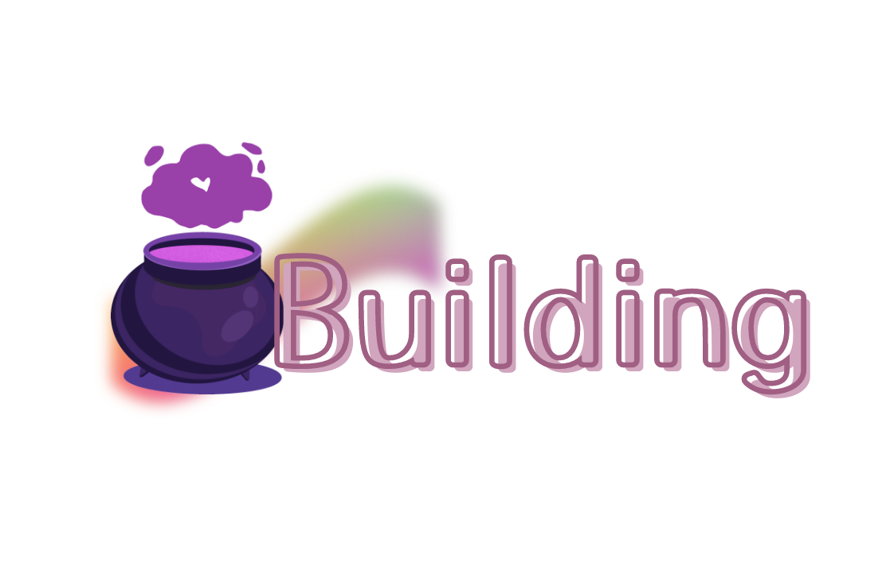

Summon the power of ChatGPT with a magical keyboard shortcut, just like a true sorcerer!

- Set up an enchanting keyboard shortcut.
- Call ChatGPT at any moment throughout your mystical journey!
- Auto light/dark theme that aligns with your system's aura :D

<br />



<br />



<br />

- You will be prompted to enter an API Key for the OpenAI API, in order to obtain API keys, request access to [OpenAI API](https://openai.com/api/) and follow OpenAI's instructions [here](https://platform.openai.com/account/api-keys).

<br />


<br />

- Once you summon the chat, you can start typing your prompts, press enter to send, and the response from OpenAI will stream down.
- If you type a prompt that begins with the ~ character, it will be considered a spell!
- Spells don't go straight to OpenAI. instead, they perform special actions:
    | Spell          | Action |
    |----------------|-----------|
    | ~history       | Displays your previous chats. You can click on any chat to switch context. |
    | ~clear-history | Clears all your chat history. |
    | ~avatar        | Changes your user avatar. |
    | ~export        | Exports your current chat as JSON. |

<br />


<br />

<br />



<br />
First make sure you have the following requirements:

- [Rust](https://www.rust-lang.org/)
- [Node.js](https://nodejs.org/en/)
- For macOS users, make sure you have Clang and macOS dev tools:
```zsh
xcode-select --install
```
- For Windows users, you would need [Microsoft Visual Studio C++ Build Tools](https://visualstudio.microsoft.com/visual-cpp-build-tools/)
- For Linux users, make sure to install the following dependencies:

For Arch Linux
```zsh
sudo pacman -Syu
sudo pacman -S --needed webkit2gtk base-devel curl wget openssl appmenu-gtk-module gtk3 libappindicator-gtk3 librsvg libvips
```

For Ubuntu or other debian-based distros
```bash
sudo apt update
sudo apt install libwebkit2gtk-4.0-dev build-essential curl wget libssl-dev libgtk-3-dev libayatana-appindicator3-dev librsvg2-dev
 ```

1. Clone this repo in a directory of your choice:
```console
  git clone https://github.com/fayez-nazzal/SummonGPT/edit/master SummonGPT
```

2. Enter the cloned directory:
```console
  cd SummonGPT
```

3. Run the following commands to start the build process:
```console
npm i -g pnpm
pnpm install
pnpm tauri build
```

4. You will find resulting binaries in `SummonGPT/src-tauri/target/release`.

<br />


This enchanted creation is done by using the power of the marvelous [Tauri Toolkit](https://tauri.app/). Crafted with the arcane arts of [SolidJS](https://www.solidjs.com/) & [Rust](https://www.rust-lang.org/) .
