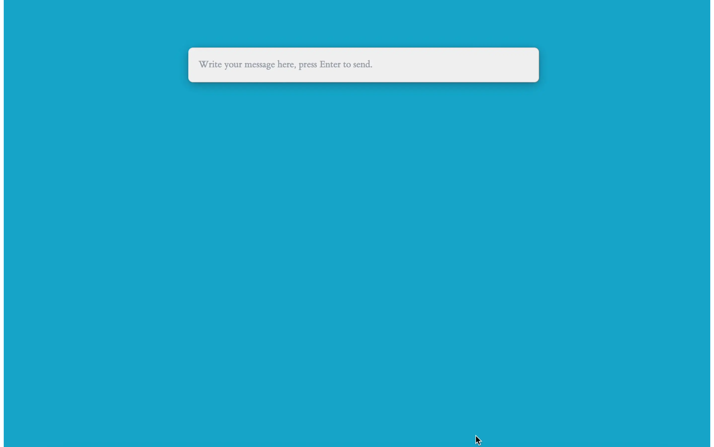

# SummonGPT

Summon ChatGPT using a keyboard shortcut, just like a sorcerer!

- Setup a keyboard shortcut.
- Call ChatGPT right away at any time throughout the day!
- Auto light/dark theme that matches your system preferences :D



## Requirements 

- You will be prompted to enter an API Key for the OpenAI API, in order to obtain API keys, request access to [OpenAI API](https://openai.com/api/) and follow OpenAI's instructions [here](https://platform.openai.com/account/api-keys).

### Requirements for building from source
- [Rust](https://www.rust-lang.org/)
- [Node.js](https://nodejs.org/en/)
- For macOS users, make sure you have Clang and macOS dev tools:
```zsh
xcode-select --install
```
- For Windows users, you would need [Microsoft Visual Studio C++ Build Tools](https://visualstudio.microsoft.com/visual-cpp-build-tools/)
- For Linux users, make sure to install the following dependencies:

For Arch Linux
```zsh
sudo pacman -Syu
sudo pacman -S --needed webkit2gtk base-devel curl wget openssl appmenu-gtk-module gtk3 libappindicator-gtk3 librsvg libvips
```

For Ubuntu or other debian-based distros
```bash
sudo apt update
sudo apt install libwebkit2gtk-4.0-dev build-essential curl wget libssl-dev libgtk-3-dev libayatana-appindicator3-dev librsvg2-dev
 ```

## Installation
Please build from source :D

## Building From Source

### Building

1. Clone this repo in a directory of your choice:
```console
  git clone https://github.com/fayez-nazzal/SummonGPT/edit/master SummonGPT
```

2. Enter the cloned directory:
```console
  cd SummonGPT
```

3. Run the following commands to start the build process:
```console
npm i -g pnpm
pnpm install
pnpm tauri build
```

4. You will find resulting binaries in `SummonGPT/src-tauri/target/release`.

## Techs used
This project is done by using the power of the awesome [Tauri Toolkit](https://tauri.app/). Written using [SolidJS](https://www.solidjs.com/) & [Rust](https://www.rust-lang.org/) .
